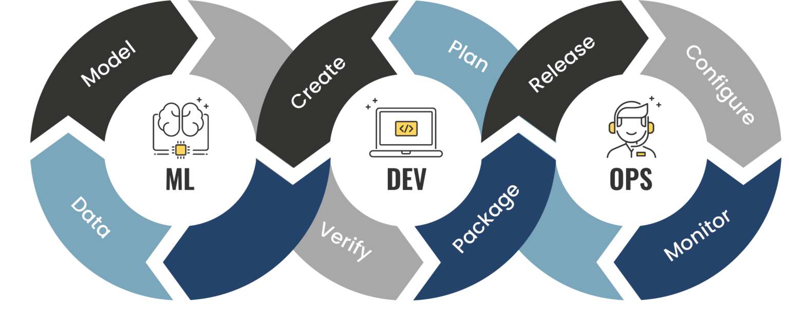

<h1 align="center">PROYECTO INDIVIDUAL Nº1   Machine Learning Operations (MLOps)</h1>

  

  <a href="https://www.linkedin.com/in/rodrigohuarachi/" style="color: #4682A9;">
    by Rodrigo Huarachi
  </a>

# **Introducción** 

En este proyecto se nos pide desarrollar un `MVP (Minimum Viable Product)` para la empresa **Steam**.
Para su desarrollo, tenemos que realizar una `API` desplegada en un servicio en la nube y un `Sistema de Recomendación`, además, tenemos que implementar un análisis de sentimientos sobre los reseñas de los usuarios de los juegos.

# **Contexto** 

Steam es una plataforma digital de distribución de videojuegos desarrollada por Valve Corporation, que permite a los usuarios comprar, descargar y jugar una amplia variedad de juegos en línea. Además de ser una tienda de juegos, Steam también ofrece funciones sociales y de comunidad, como chats, grupos y la posibilidad de compartir contenido personalizado. Con una extensa biblioteca de títulos y ofertas periódicas, Steam se ha convertido en una de las principales plataformas para la adquisición y disfrute de videojuegos en todo el mundo.

# **Datasets**

Se nos proporcionó 3 archivos en formato Gzip. El cual contiene datasets de tipo JSON:
1. `steam_games.json`: Informacion general de los contenidos en la plataforma Steam.
2. `user_reviews.json`: Informacion de las reseñas de los usuarios.
3. `users_items.json`: Informacion de la actividad de los usuarios.

# **Desarrollo**
## **Extract, Transform and Load (ETL)**

Uno de los procesos mas importantes a la hora de desarrollar un proyecto de Data, es hacer un ETL sobre los datos.

En este proceso se realizo la ingesta de los datos, ya que para poder trabajarlo de manera óptima, se convirtieron los datasets a DataFrames. Luego se da un primer vistazo a los 3 DataFrames que obtuvimos de los archivos JSON y en base a eso empezamos con la limpieza y transformación de los datos, como por ejemplo:
- Limpieza de registros vacios.
- Completar datos faltantes.
- Eliminación de columnas innecesarias y redundancias.
- Creación de nuevas variables a partir del análisis exploratorio de datos.
- Desanidar columnas con datos anidados.
- Transformaciones de tipos de dato.
- Etc.

> Para visualizar los pasos que implemente para el ETL, puede seguir este enlace: [ETL](/Notebooks/ETL.ipynb)

## **Feature Engineering**

En este paso, aplicamos un análisis de sentimiento con `NLP` al dataset de `Reviews` utilizando la libreria `nltk`. Para ello, creamos una columnas llamada `sentimen_analysis` que tiene la siguiente escalada:
- 0 si es malo.
- 1 si es neutral o sin reseña.
- 2 si es positivo.

Esta nueva columna nos facilitara el trabajo para la creación de los *Modelos de Machine Learning*.  
Además en este apartado, creamos nuevos datasets para las funciónes solicitadas y para el `Sistema de Recomendación` y asi poder optimizar los recursos a la hora de ejecutar la API.

> Para visualizar los pasos que se implemento en este proceso, puede seguir este enlace: [Feature Engineering](/Notebooks/Feature%20Engineering.ipynb)

## **Exploratory Data Analysis (EDA)**

Es este apartado, realizamos un EDA a los datasets que obtuvimos del ETL. 
Explorando datos como:
- Porcentaje de nulos por columnas.
- Cantidad de Items lanzados por año.
- Distribución de los precios en los ítems.
- TOP 5 Desarrolladores.
- Distribución de las reseñas.
- etc...

Tambien realizamos este proceso al dataset creado para el Sistema de Recomendación, que tiene datos como:
- **user_id**: ID del usuario.
- **item_id**: ID del item.
- **app_name**: Nombre del item.
- **rating**: Puntuacion del rating calculado en el proceso de `Feature Engineering`.

En este dataset analizamos:
- Distribución del rating.
- Top 5 items mas votados.
- Item más popular.

> Para visualizar los pasos que se implemento en este proceso, puede seguir este enlace: [EDA](/Notebooks/EDA.ipynb)

## **Modelo de Machine Learning**

Para el Modelo de Recomendación, usamos el enfoque **Collaborative Filtering**:

* *User-Item*:
    * Se identifican usuarios similares.
    * Se recomeiendan nuevos ítems a otros usuarios basados en el rating dado por otros usuarios similares.
* *Item-based*:
    * Calcular la similitud entre items.
    * Encontrar los *'mejores items similares'* a los que un usuarios no tenga evaluados y recomendarselos.

En este caso, vamos a usar dos tipos de filtros para las funciones:
- User-Items: Se toma a un usuario, se encuentran usuarios similares y se recomiendan ítems que a esos usuarios le gustaron. En este caso el input es el ID del usuarios y el output sera una lista de 5 ítems.
- Item-Item: Se toma un ítem, se encuentran items similares en base a los TAGs que tenemos de informacion y se devuelve 5 items similares.

Para el desarrollo del Sistema de recomendación, usamos el dataset creado en la etapa de `Feature Engineering` y además creamos otro dataset que tiene informacion de:
- **id**: ID del centenido.
- **app_name**: Nombre del contenido.
- **tags**: Etiquetas del conetnido.

Este nuevo dataset nos brinda informacion relevante para poder clasificar el contenido en base a los TAGs y asi poder calcular la distancia de coseno como similitud, y generar una matriz.

> Para visualizar los pasos que se implemento en este proceso, puede seguir este enlace: [Sistema de Recomendación](/Notebooks/Sistema%20de%20Recomendacion.ipynb)

## **Desarrollo de la API**

Una vez que tenemos los datasets necesarios para las funciónes y para el Sistema de Recomendación, procedemos a desarrollar la API, que en este caso utilizamos el framework `FastAPI` e hicimos el deploy en `Render`.
Esta API contiene 7 funciones:

- **userdata**: 

En esta función, toma como parámetro un *'user_id'* y se nos pide devolver la **cantidad de dinero gastado** por el usuario, el **porcentaje de recomendación** y la **cantidad de items**.
- **countreviews**: 

En esta función, se toma 2 parámetros lo cual son fechas, y se nos pide devolver la **cantidad de usuarios** que realizaron *reviews* entre las fechas dadas y el **porcentaje** de recomendacion.
- **genre**: 

Esta función tomo un parametro que es el género y se nos pide devolver el puesto en el que se encuentra el género sobre el ranking de los mismos analizados bajo la columna *PlayTimeForever*.
- **userforgenre**: 

Esta función toma un parámetro que es el género y se nos pide devolver el **TOP 5** de usuarios con mas horas de juego en el género dato, con su **URL(del usuario)** y **user_id**.
- **developer**: 

Esta función toma un parámetro que es el nombre de la empresa Desarrolladora, y se nos pide devolver el **porcentaje** de contenido *FREE* por año segun la empresa.
- **sentiment_analysis**: 

Esta función toma un parámetro que es el año del posteo de la reseña y devuelve una lista con la cantidad de reseñas categorizadas con un análisis de sentimiento.
- **recomendacion_juego**: 

Esta función recibe como parámetro el nombre de un juego y devuelve una lista con 5 juegos recomendados similares al ingresado.

> Para poder interactuar con las funciones, puede ingresar a este link: [Deploy en Render](https://deploy-pi-rodrigo-huarachi.onrender.com/)

